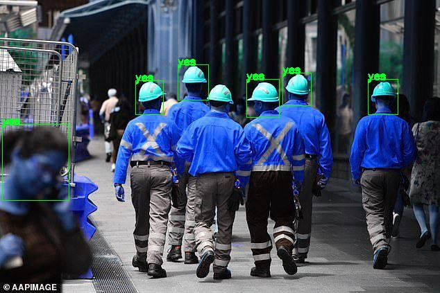

# Pytorch Faster RCNN

- Note that this PyPi package is no longer maintained. It will work fine upto this release, but I won't do bug fixes.
- The entire code and API is migrated to [Quickvison](https://github.com/Quick-AI/quickvision), it has similar API and is maintained actively.


Faster RCNN Fine-Tune Implementation in Pytorch.

## How to use ?
1. git clone the repo
```
git clone https://github.com/oke-aditya/pytorch_fasterrcnn.git
```
2. Install PyTorch and torchvision for your system.

Simply edit the config file to set your hyper parameters.

3. Keep the training and validation csv file as follows

NOTE

Do not use target as 0 class. It is reserved as background.


```
image_id xtl ytl xbr ybr      target
1        xmin ymin xmax ymax   1
1        xmin ymin xmax ymax   2
2		 xmin ymin xmax ymax   3
```

4. Simply edit the config file to set your hyper parameters

5. Run the train.py file

# Features: -

- It works for multiple class object detection.

## Backbones Supported: -


- Note that backbones are pretrained on imagenet. 

- Following backbones are supported

1. vgg11, vgg13, vgg16, vgg19
2. resnet18, resnet34, resnet50, resnet101, resnet152
3. renext101
4. mobilenet_v2


Sample Outputs

# Helmet Detector


# Mask Detector


If you like the implemenation or have taken an inspiration do give a star :-)


